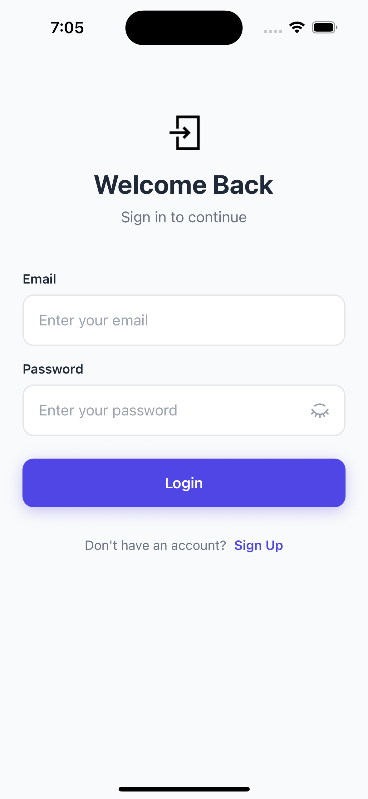
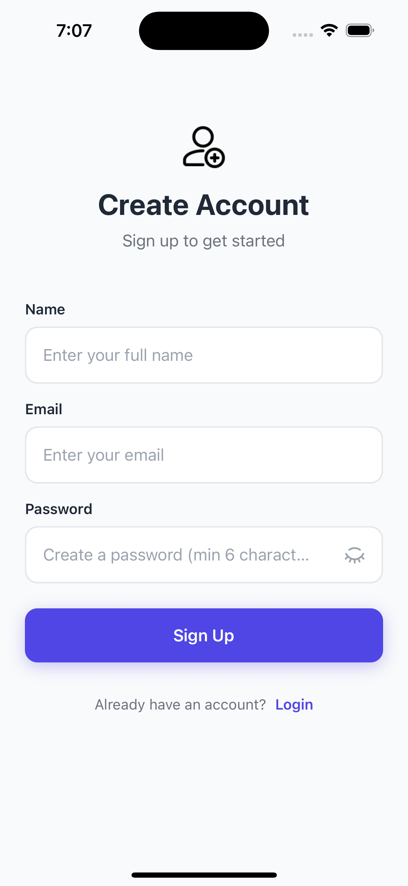
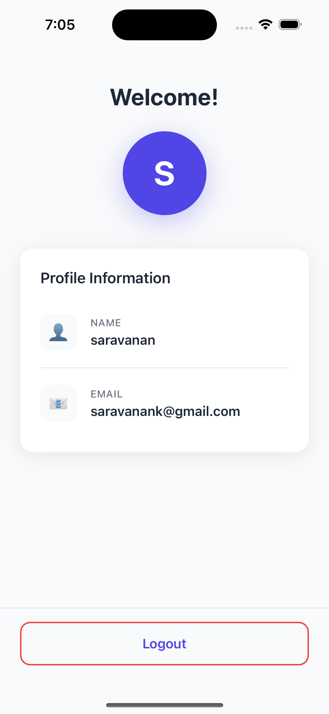
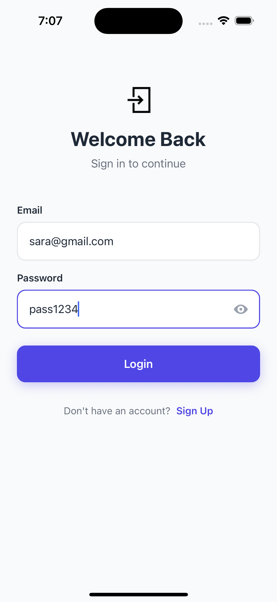
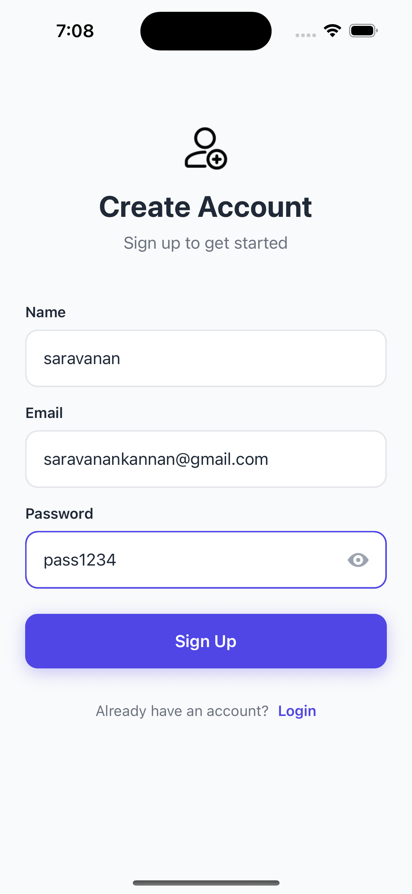
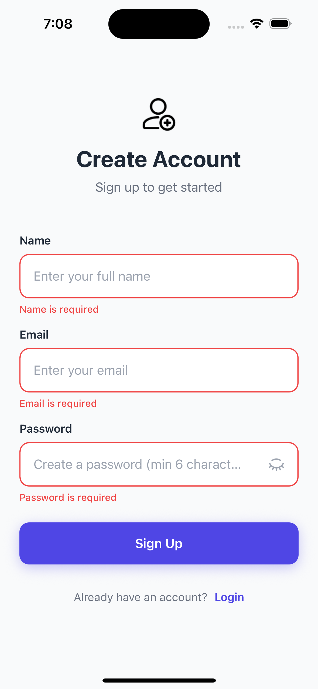
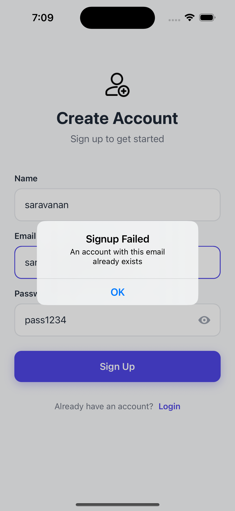

This is a new [**React Native**](https://reactnative.dev) project, bootstrapped using [`@react-native-community/cli`](https://github.com/react-native-community/cli).

# Getting Started

> **Note**: Make sure you have completed the [Set Up Your Environment](https://reactnative.dev/docs/set-up-your-environment) guide before proceeding.

## Step 1: Start Metro

First, you will need to run **Metro**, the JavaScript build tool for React Native.

To start the Metro dev server, run the following command from the root of your React Native project:

```sh
# Using npm
npm start

# OR using Yarn
yarn start
```

## Step 2: Build and run your app

With Metro running, open a new terminal window/pane from the root of your React Native project, and use one of the following commands to build and run your Android or iOS app:

### Android

```sh
# Using npm
npm run android

# OR using Yarn
yarn android
```

### iOS

For iOS, remember to install CocoaPods dependencies (this only needs to be run on first clone or after updating native deps).

The first time you create a new project, run the Ruby bundler to install CocoaPods itself:

```sh
bundle install
```

Then, and every time you update your native dependencies, run:

```sh
bundle exec pod install
```

For more information, please visit [CocoaPods Getting Started guide](https://guides.cocoapods.org/using/getting-started.html).

```sh
# Using npm
npm run ios

# OR using Yarn
yarn ios
```

If everything is set up correctly, you should see your new app running in the Android Emulator, iOS Simulator, or your connected device.

---

# About This App

## Overview

This is a **User Authentication Application** that demonstrates a complete authentication system built with modern React Native practices. It features secure user registration, login, profile management, and local storage persistence.

## 📱 Screenshots

### Main Screens
<p align="center">
  
  
  
</p>

### Authentication Success
<p align="center">
  
  
</p>

### Error Handling
<p align="center">
  
  
  
</p>

## Features

### Core Functionality
- **User Registration** - Create new accounts with email, password, and name
- **User Login** - Secure authentication with email and password
- **Profile Management** - View and manage user profile information
- **Session Persistence** - Automatic login on app restart
- **Secure Logout** - Clear session and return to login screen

### Security
- **Password Hashing** - SHA-256 encryption for password storage
- **Input Validation** - Real-time form validation with custom rules
- **Duplicate Prevention** - Email uniqueness checking
- **Data Sanitization** - Automatic email normalization and input trimming

### User Experience
- **Clean UI** - Modern, minimalist design with consistent styling
- **Error Handling** - Comprehensive error messages and boundary components
- **Loading States** - Visual feedback during async operations
- **Form Validation** - Real-time validation with helpful error messages
- **Navigation** - Smooth transitions between screens

## Architecture

### Tech Stack
- **Framework**: React Native 0.83.1
- **Language**: TypeScript 5.8.3
- **Navigation**: React Navigation (Native Stack)
- **Storage**: AsyncStorage
- **Crypto**: CryptoJS (SHA-256)
- **Testing**: Jest + React Test Renderer

### Project Structure

```
UserAuthenticationApp/
├── src/
│   ├── components/          # Reusable UI components
│   │   ├── AuthScreenLayout.tsx    # Layout wrapper for auth screens
│   │   ├── Button.tsx              # Custom button component
│   │   ├── Card.tsx                # Card container component
│   │   ├── ErrorBoundary.tsx       # Error handling wrapper
│   │   ├── FormFields.tsx          # Dynamic form field renderer
│   │   ├── Icon.tsx                # Icon component with emoji support
│   │   ├── Input.tsx               # Text input with validation
│   │   ├── ProfileCard.tsx         # User profile display card
│   │   └── ProfileInfoRow.tsx      # Profile information row
│   │
│   ├── screens/             # App screens
│   │   ├── LoginScreen.tsx         # User login screen
│   │   ├── SignupScreen.tsx        # User registration screen
│   │   └── HomeScreen.tsx          # User profile/home screen
│   │
│   ├── context/             # React Context for state management
│   │   └── AuthContext.tsx         # Authentication state & operations
│   │
│   ├── hooks/               # Custom React hooks
│   │   ├── useAuth.ts              # Authentication hook
│   │   └── useForm.ts              # Form management hook
│   │
│   ├── navigation/          # Navigation configuration
│   │   └── AppNavigator.tsx        # Main navigation stack
│   │
│   ├── utils/               # Utility functions
│   │   └── crypto.ts               # Password hashing utilities
│   │
│   ├── config/              # App configuration
│   │   └── formConfig.ts           # Form field configurations
│   │
│   ├── constants/           # App constants
│   │   └── colors.ts               # Color palette
│   │
│   └── types/               # TypeScript type definitions
│       └── auth.ts                 # Authentication types
│
├── __tests__/               # Unit tests
│   ├── App.test.tsx
│   ├── crypto.test.ts
│   ├── signup.test.ts
│   └── validation.test.ts
│
├── android/                 # Android native code
├── ios/                     # iOS native code
└── App.tsx                  # Root component
```

### Design Patterns

#### Context + Hooks Pattern
- **AuthContext**: Centralized authentication state management
- **useAuth Hook**: Simplified access to auth operations
- **useForm Hook**: Reusable form state and validation logic

#### Component Composition
- Small, focused components with single responsibilities
- Layout components for consistent screen structure
- Compound components for complex UI patterns

#### Configuration-Driven Forms
- Declarative form field definitions
- Automatic form generation from config
- Centralized validation rules

## Authentication Flow

```
1. App Launch
   └─> Check AsyncStorage for session
       ├─> User found → Navigate to Home
       └─> No user → Navigate to Login

2. Sign Up
   └─> User fills form
       └─> Validate inputs
           └─> Check email uniqueness
               └─> Hash password (SHA-256)
                   └─> Store in AsyncStorage
                       └─> Create session → Navigate to Home

3. Login
   └─> User enters credentials
       └─> Fetch users from AsyncStorage
           └─> Find user by email
               └─> Verify password hash
                   └─> Create session → Navigate to Home

4. Logout
   └─> Clear current session
       └─> Navigate to Login
```

## Testing

The app includes comprehensive unit tests covering:

- **Authentication Logic** - Login, signup, and logout flows
- **Password Security** - Hashing and verification
- **Form Validation** - Input validation rules
- **Data Persistence** - AsyncStorage operations
- **Edge Cases** - Duplicate emails, invalid inputs, etc.

Run tests with:
```bash
npm test
```

## UI Components

### Reusable Components
- **Input**: Text input with validation and error display
- **Button**: Customizable button with loading states
- **Card**: Container component for grouped content
- **Icon**: Emoji-based icon component
- **FormFields**: Dynamic form generator
- **AuthScreenLayout**: Consistent layout for auth screens
- **ErrorBoundary**: Error catching and display

## Security Features

1. **Password Hashing**: All passwords are hashed using SHA-256 before storage
2. **No Plain Text Storage**: Passwords are never stored in plain text
3. **Session Management**: Secure session handling with AsyncStorage
4. **Input Sanitization**: Email normalization and whitespace trimming
5. **Validation**: Client-side validation for all user inputs

